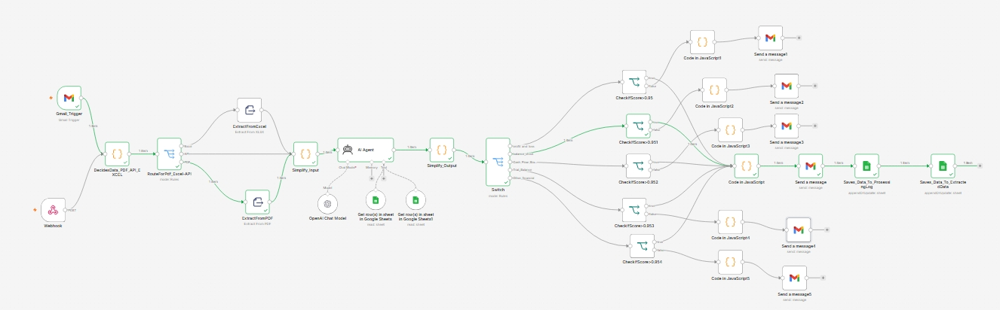
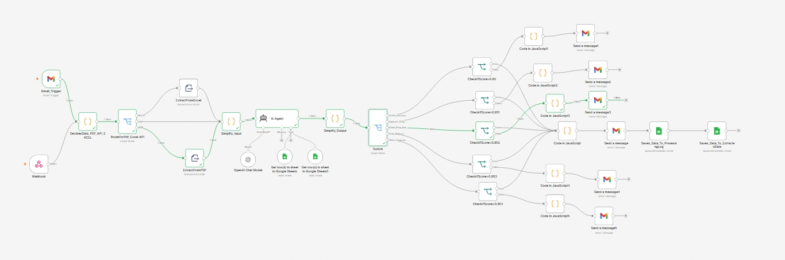
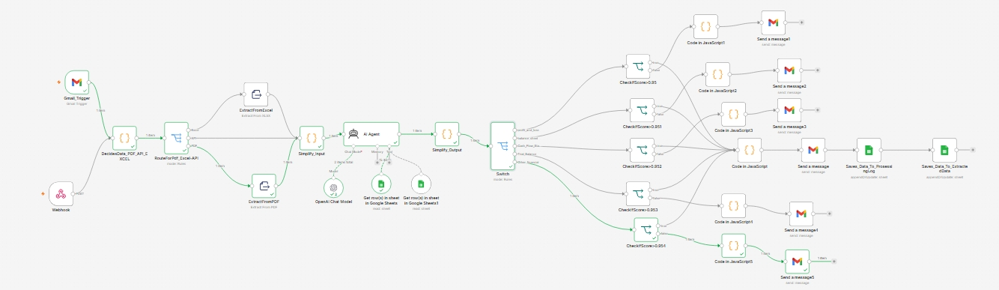
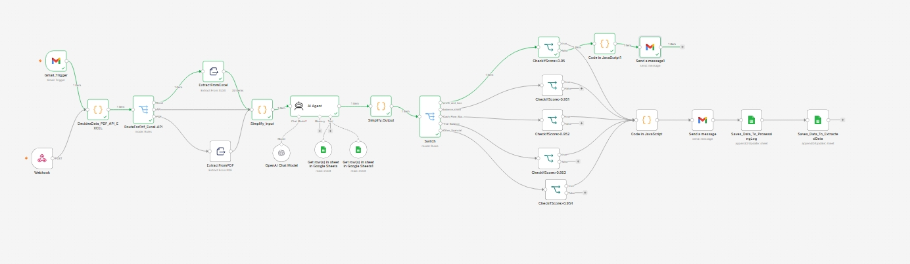
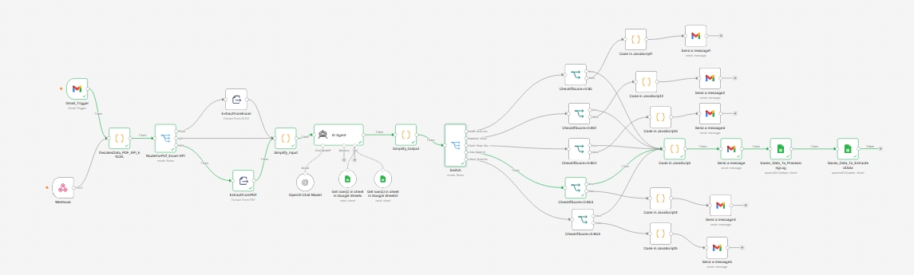
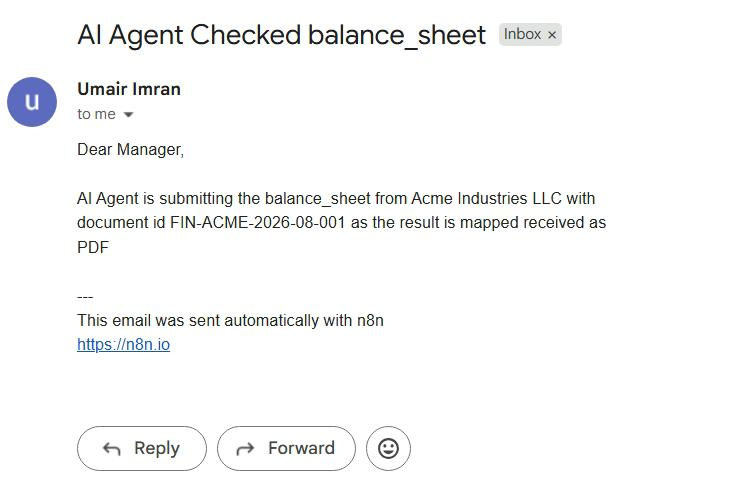
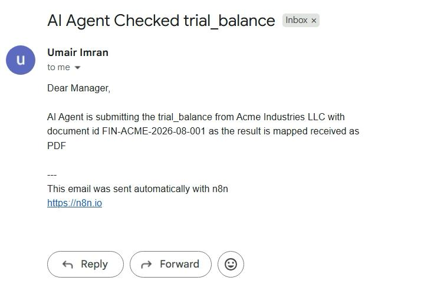
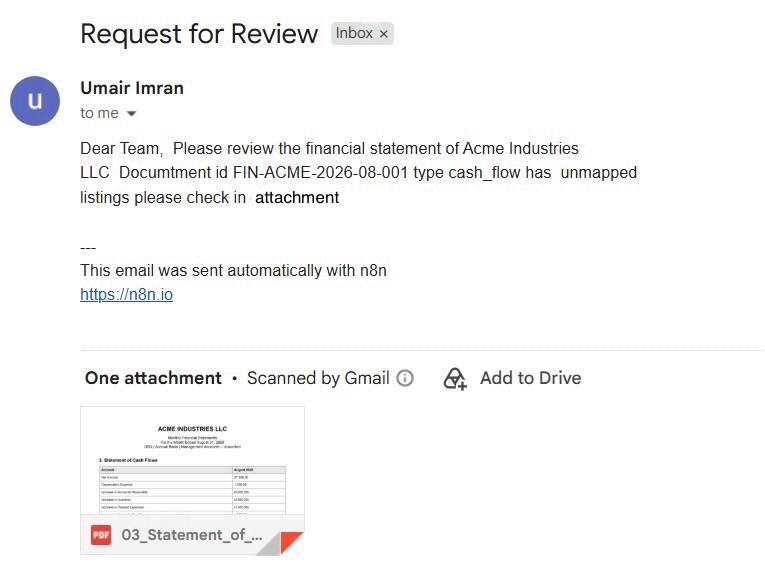
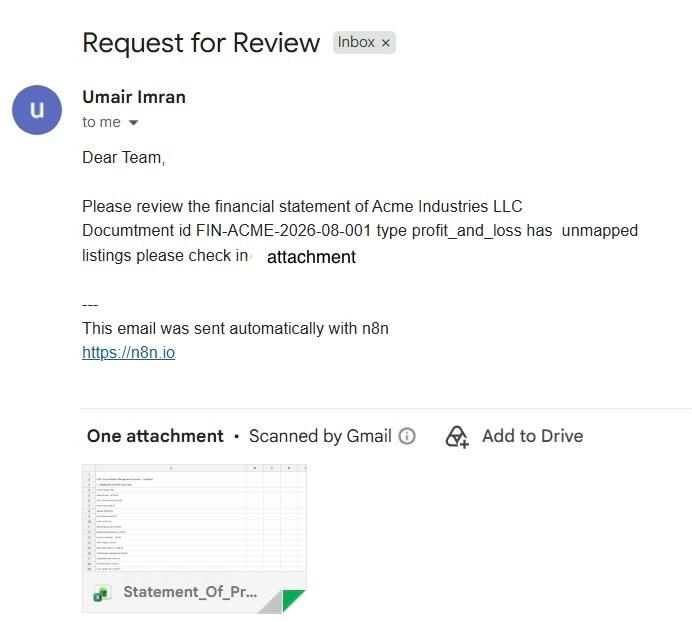

# AccountFlow-AI-Automated-Accounting-Data-Workflow
AccountFlow AI is an AI-powered financial document processing and accounting automation system built with n8n. It automates the process of receiving financial documents, extracting structured financial data, mapping accounts to a Chart of Accounts, validating financial information, and routing exceptions for human review.
The system can work with PDF, Excel, and API-based financial inputs and converts financial information into a consistent structured format that can be used for downstream accounting processes.

What It Does
Accepts financial documents and API-based financial data
Identifies and structures financial statement information
Extracts accounts, amounts, reporting periods, currencies, and document metadata
Maps extracted accounts against a predefined Chart of Accounts
Handles calculated financial totals separately from mapping exceptions
Validates extracted and mapped financial information
Routes genuine mapping or processing exceptions to a human review queue
Maintains processing logs and structured financial records
Stores extracted and mapped data in Google Sheets
Produces consistent JSON-based outputs for further automation
Workflow Architecture

Financial Input → Input Detection → Data Extraction → Data Structuring → Chart of Accounts Mapping → Financial Validation → Exception Detection → Human Review / Final Output

The workflow is designed to keep the AI focused on processing and mapping financial information while using structured rules and source data to reduce unnecessary assumptions and maintain consistent outputs.

Technologies & Skills
n8n — Workflow orchestration and automation
AI Agents / OpenAI — Financial data processing and account mapping
Google Sheets — Structured financial data, COA, logs, and review queues
Gmail — Document intake
REST APIs — External financial data input
JavaScript — Data transformation and workflow logic
JSON — Structured data exchange
PDF / Excel Processing — Financial document handling
Human-in-the-Loop Automation — Exception and review workflows
Key Concepts Demonstrated

AI Automation · Accounting Automation · Financial Document Processing · Chart of Accounts Mapping · Data Extraction · Financial Validation · Human-in-the-Loop · Workflow Automation · API Integration · Structured Data Processing
## Workflow Screenshots

## Balance sheet workflow
,

## Cash Flow workflow
,

## Other Finance wrokflow
,

## Profit & Loss workflow
,

## Trial Balance workflow
,

## Balance sheet Email
,

## Trial Balance Email
,

## Cash Flow Email
,

## Profit & Loss Email
,

## Other Finance Email
,

